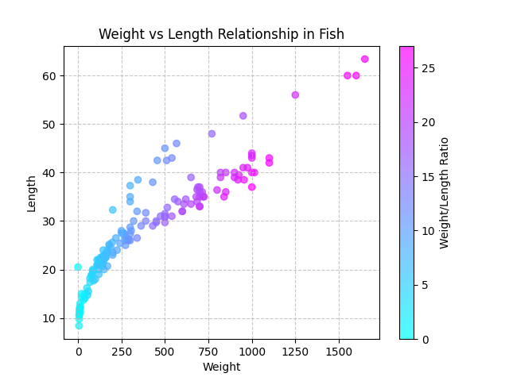
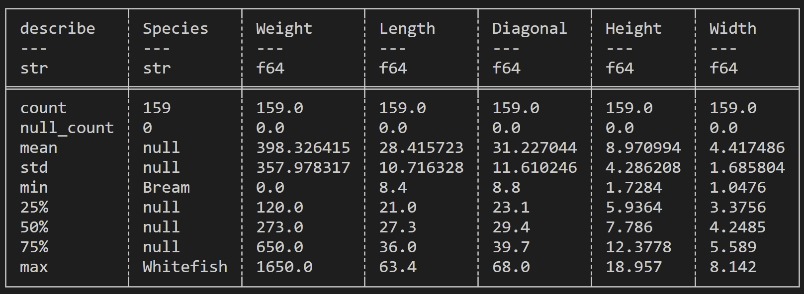
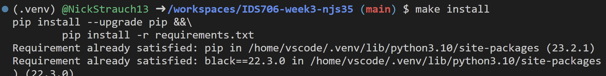
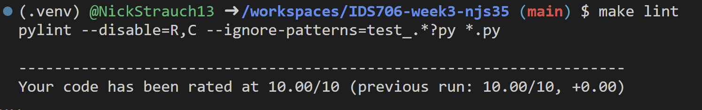
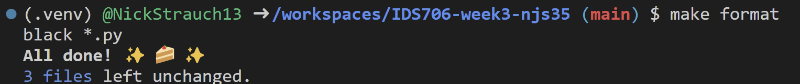
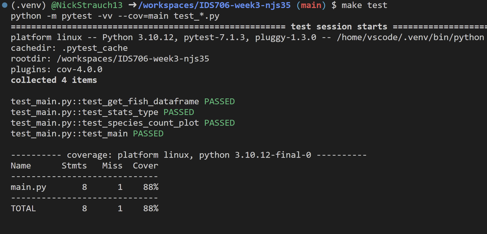

# Week 3 Mini-Project

### Polars Descriptive Statistics

This project builds upon the GitHub template created in Week 1. The Polars library is leveraged to generate descriptive statistics for a fish csv dataset [(Fish Dataset)](https://github.com/rickiepark/hg-mldl/raw/master/fish.csv).

### Fish Size Relationship 

### Descriptive Statistics

### Makefile Pass results
- `make install`

- `make lint`

- `make format`

- `make test`
